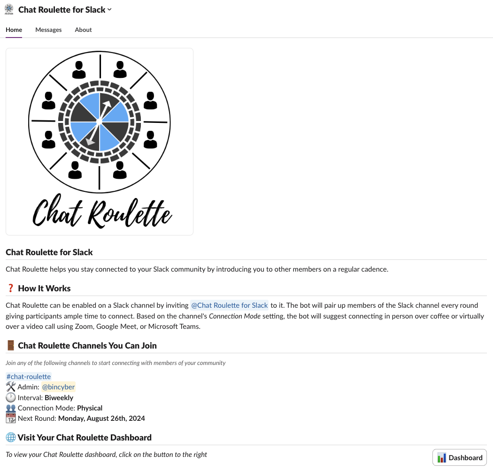
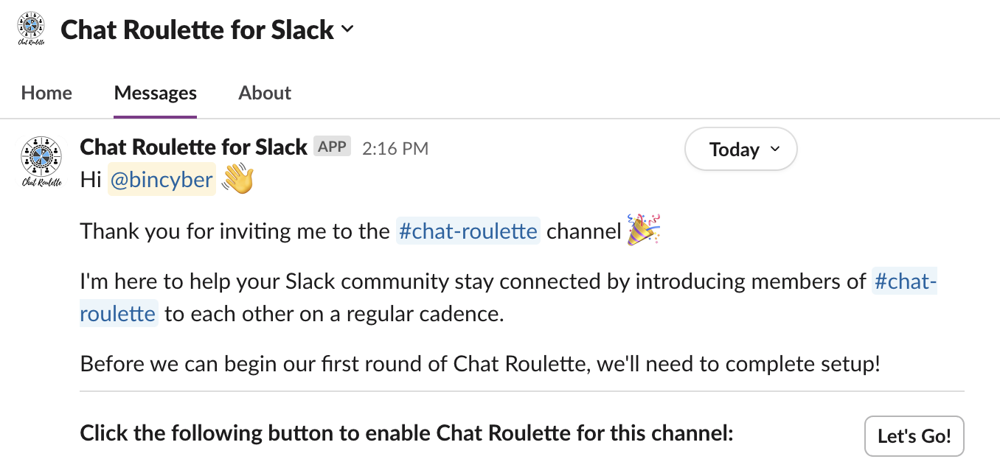
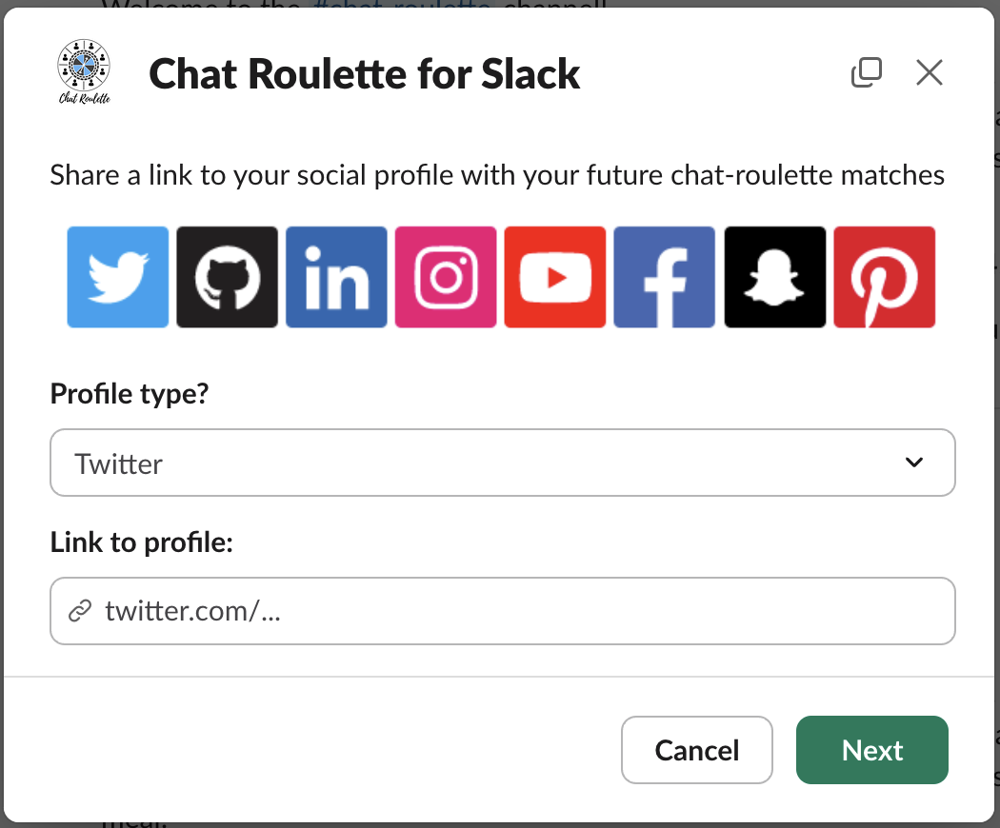
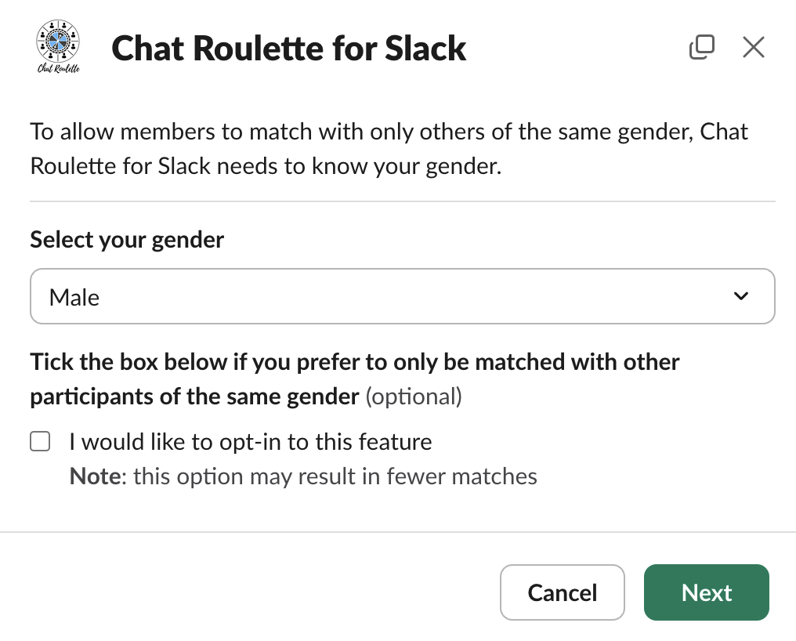
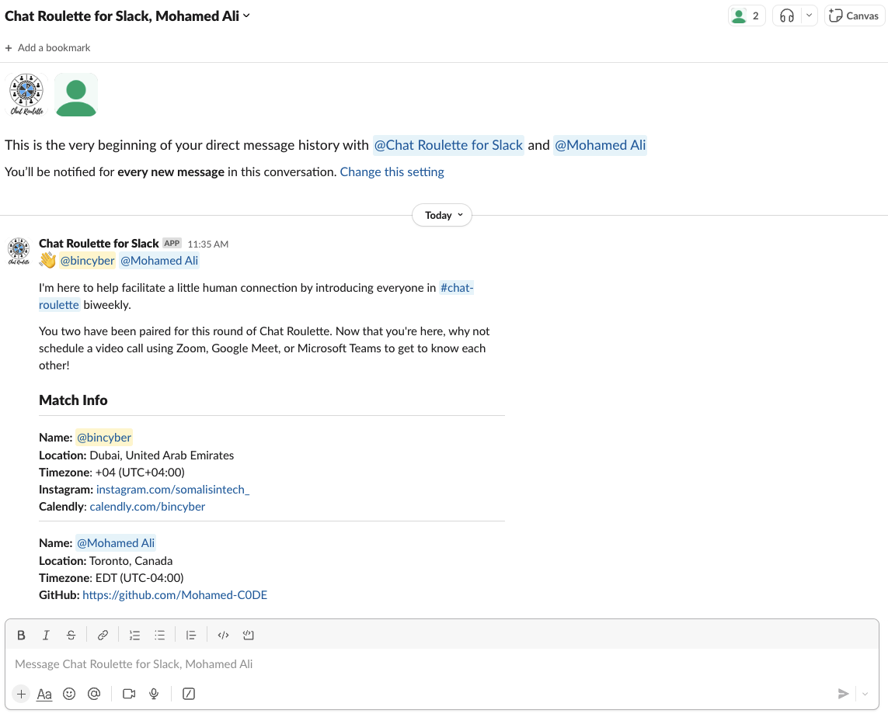
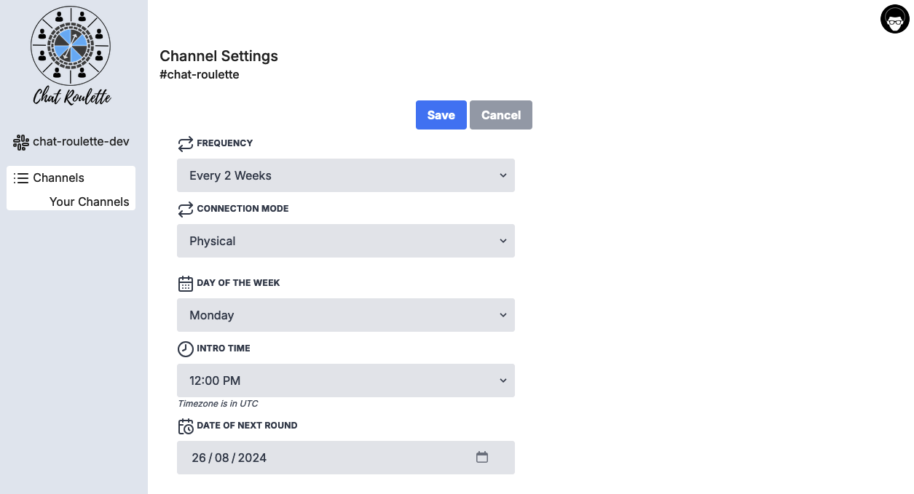
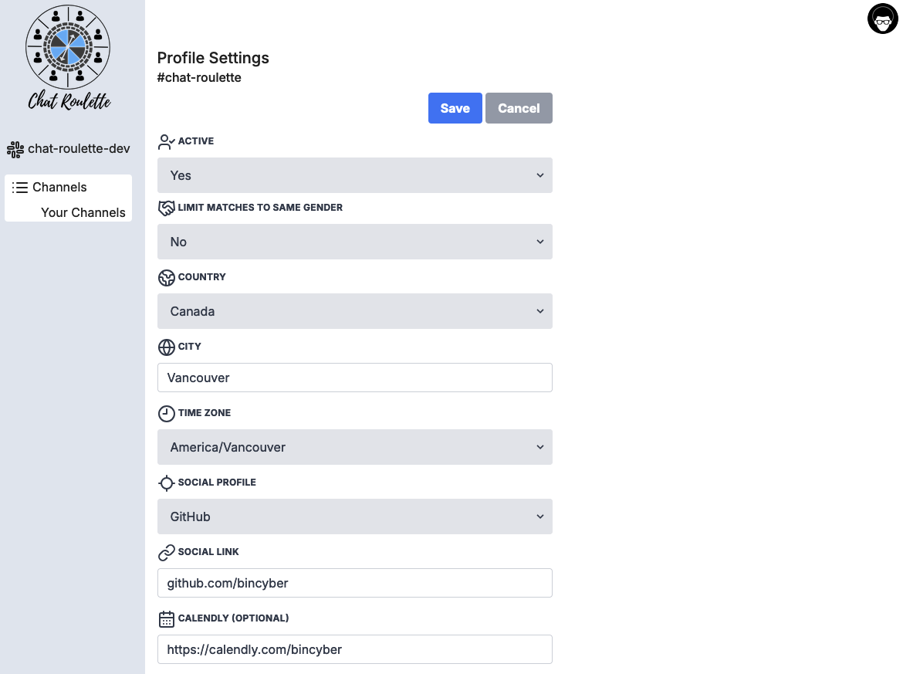

# Chat Roulette

_Chat Roulette for Slack is an open-source chat-roulette app for Slack. A no-frills, self-hosted, free alternative to the popular [Donut](https://www.donut.com/) app._

## What is Chat Roulette?

Chat Roulette helps you stay connected to your Slack community by introducing you to other members on a regular cadence.

It works by inviting the `@chat-roulette-bot` to your Slack channel. The bot will pair up members of the Slack channel every round (eg, every two weeks), giving participants ample time to connect. The bot will suggest connecting in person over coffee or virtually over a video call using Zoom, Google Meet, or Microsoft Teams based on each channel's _Connection Mode_ setting.

### Screenshots

*Click on the images to view full-screen.*

|  |  |  |  |
| :--------: | :---------: | :-----: | :-----: |
| __App Home__ | __Greet Admin__  | __Greet User__ | __Onboarding Location__ |
 |  |  |  |
| __Onboarding Profile__ |  __Gender__ | __Calendly__ | __Match__ |
|  |  |  |  |
| __Check In__ | __Check In Response__  | __Report Stats__  | __Sign In__ |
|  |  |  |  | |
| __UI__  | __History__ |  __Channel Settings__ | __Profile Settings__ |

## Deployment

See the [deployment guide](./docs/deployment.md) for how to run the app on [fly.io](https://fly.io/) or similar platforms.

## Configuration

To customize the configuration for the app, see [configuration.md](./docs/configuration.md).

## Contributing

_Chat Roulette for Slack_ is free, open-source software licensed under AGPLv3.

We encourage the following contributions at this time: user feedback, documentation, and bug reports.

To get started, take a look at [CONTRIBUTING.md](./CONTRIBUTING.md) and the [development guide](./docs/development.md).

## Acknowledgements

### Contributors

_Chat Roulette for Slack_ was made possible thanks to the work of the following contributors:

<table>
  <tbody>
    <tr>
      <td align="center"><a href="https://github.com/bincyber"> <b>Ali</b></td>
      <td align="center"><a href="https://github.com/AhmedARmohamed"> <b>Ahmed Mohamed</b></td>
      <td align="center"><a href="https://github.com/Mohamed-C0DE"> <b>Mohamed Ali</b></td>
      <td align="center"><a href="https://github.com/moabukar"> <b>Mohamed Abukar</b></td>
    </tr>
  </tbody>
</table>

### Libraries

_Chat Roulette for Slack_ was built using the Go libraries listed in [go.mod](go.mod).

## License

_Chat Roulette for Slack_ is distributed under [AGPL-3.0](LICENSE).
